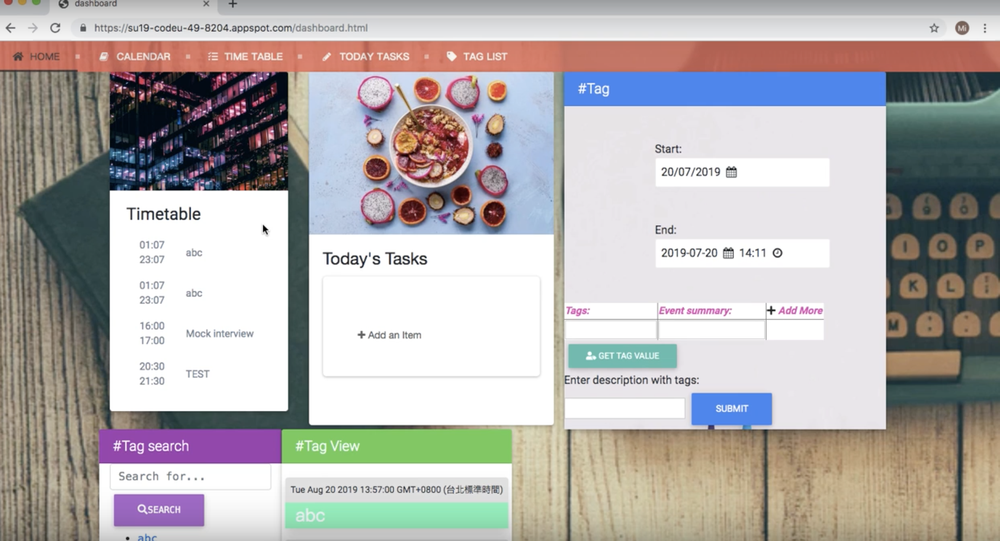

# Calendar Helper

## Introduction

This is a team project building by 3 young girls during CodeU program held by Google. Are you the person who likes to be organized and productive every single day? Did you find yourself using numerous to-do list/ calendar apps for different purposes and sometimes find yourself a bit trouble switching between these apps? Then give Calendar Helper a try. Calendar Helper is an all in one platform for to-do list and calendar. The highlight of Calendar Helper is we have added tagging system to the calendar events/tasks. Tags categorize your events and tasks. Another great feature of Calendar is our dashboard design. Our dashboard is good for visualizing all your tasks. Your task will be organized by tags in your dashboard so that you will never miss out any important events ever again. Try out Calendar Helper, we won't let you down.

## Prerequisite

Java: 8 or higher, Maven

## Features

1. dashboard
2. Timetable
3. Today's Tasks
5. Search by Tags
6. Connectig with Google Calendar API

## Project Status

Currently we have stopped maintaining due to some reasons. If starting again we think first of all the backend part will need to rewrite cause it's a bit messy and unorganized right now. The frontend design will need to work on make it more user friendly. 

## Contribute to Calendar Helper

If your are interested in this project please contact [joycnerd](https://github.com/joycenerd)

### Contributer

* mentor: [cgnj](https://github.com/cgnj)
* [joycenerd](https://github.com/joycenerd)
* [xuau34](https://github.com/xuau34)
* [ChungYujoyce](https://github.com/ChungYujoyce)

